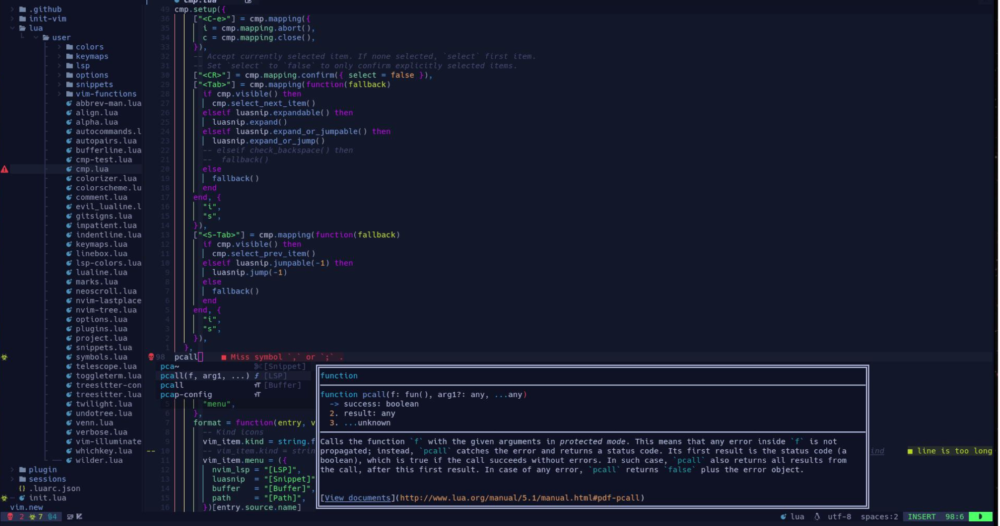

<div align="justify">
 <div align="center">
  

# **ｄｏｔｆｉｌｅｓ**

> *My Personal dotfiles*

```ocaml
ZSH / NVIM / TMUX / AWESOMEWM
```
 
<!--```ＺＳＨ  /  ＮＶＩＭ  /  ＴＭＵＸ  /  ＡＷＥＳＯＭＥＷＭ```-->

[](https://github.com/ConnerWill/dotfiles/actions/workflows/shellcheck.yml)


[](https://gitlab.com/ConnerWill/dotfiles)


</div>

---

## Installation

> *Clone this repository to use as your dotfiles*

```shell
git clone \
 --bare                                                    \
 --config status.showUntrackedFiles=no                     \
 --config core.excludesfile="${HOME}/.dotfiles/.gitignore" \
 --verbose --progress                                      \
 https://github.com/ConnerWill/dotfiles.git "${HOME}/.dotfiles"
```

> Set temporary alias *(zsh config will set up for you when loaded)*
```shell
alias dotf='git --work-tree="${HOME}" --git-dir="${HOME}/.dotfiles"'
```
 
> Then checkout the main branch and exec zsh
 
 <div align="center">
  
```diff
- This will overwrite existing files! Make sure to backup first!
```

  </div>
 
```shell
git --work-tree="${HOME}" --git-dir="${HOME}/.dotfiles" checkout --force main \
 && exec zsh
```

> If you set the alias, you can run the following instead

```shell
dotf checkout --force main && exec "${SHELL}"
```
 
<details>
 <summary><b>Single Command</b></summary>
 
 
 <div align="center">
  
 
 ```diff
- This will overwrite existing files! Make sure to backup first!
```
  
 </div>
 
```shell
 
 clear \
 && export DOTFILES="${HOME}/.dotfiles" \
 && alias dotf='git --work-tree="${HOME}" --git-dir="${DOTFILES}"' \
 && git clone \
    --bare                                                    \
    --config status.showUntrackedFiles=no                     \
    --config core.excludesfile="${DOTFILES}/.gitignore"       \
    --verbose --progress                                      \
    https://github.com/ConnerWill/dotfiles.git "${DOTFILES}"  \
 && git --work-tree="${HOME}" --git-dir="${DOTFILES}" checkout --force main \
 && exec "${SHELL}"
 
```
 
</details>
 
---
 
> *Clone this repository like a normal repository*
```console
git clone https://github.com/ConnerWill/dotfiles.git
```

***
 
> *Test full config in docker*
```shell
git clone https://github.com/connerwill/dotfiles   \
  && docker run                                    \
    -v $PWD/dotfiles:/root                         \
    -it                                            \
    archlinux                                      \
    sh -c "ln -rs ~/.config/zsh/.zshenv ~/ && pacman -Sy --noconfirm zsh tmux git fzf bat lsd neovim && chsh --shell /usr/bin/zsh && exec zsh"
```
 
---
 
> *Test ZSH with no extra packages*
```shell
git clone https://github.com/connerwill/dotfiles   \
  && docker run                                    \
    -v $PWD/dotfiles:/root                         \
    -it                                            \
    archlinux                                      \
    sh -c "ln -rs ~/.config/zsh/.zshenv ~/ && pacman -Sy --noconfirm zsh && chsh --shell /usr/bin/zsh && exec zsh"
```

***
 
<p align="right">
  [<a href="https://gitlab.com/ConnerWill/dotfiles">GitLab Mirror</a>]
</p>
 
---

 <div align="center">
 
 ```ocaml
░█▀▄░█▀█░▀█▀░█▀▀░▀█▀░█░░░█▀▀░█▀▀
░█░█░█░█░░█░░█▀▀░░█░░█░░░█▀▀░▀▀█
░▀▀░░▀▀▀░░▀░░▀░░░▀▀▀░▀▀▀░▀▀▀░▀▀▀
```


|  |  |  |
| ----------------------------------------------------------------------------------------------------------------------- | ------------------------------------------------------------------------------------------------------------------------ | ------------------------------------------------------------------------------------------------------------------------ |
  
</div>

# Table of Contents

<br>
<div align="center">

```ocaml
CLICK OR TAP ❲☰❳ TO SHOW TABLE-OF-CONTENTS
```

</div>

<details>
 <summary><b>Table of Contents</b></summary>

  ---
 
* [dotfiles](#dotfiles)
* [Table of Contents](#table-of-contents)
* [Overview](#overview)
  * [Description](##description)
  * [ScreenShots](##screenshots)
  * [Demo](##demo)
  * [ZSH](##zsh)
  * [NVim](##nvim)
  * [Tmux](##tmux)
  * [Awesome](##awesome)
  * [Lynx](##lynx)
  * [Xresources](##xresources)
  * [Kitty](##kitty)
  * [PowerShell](##powershell)
* [Installation](#installation)
  * [Dependencies](##dependencies)
    * [Dependency-1-Installation](###dependency-1-installation)
  * [Setup](##setup)
* [Usage](#usage)
* [Customization](#customization)
  * [Configuration File](##configuration-file)
    * [Hotkeys](###hotkeys)
  * [Environment Variables](#environment-variables)
* [Other](#other)

  ---

</details>  

<!--
<p align="right">(<a href="#top">back to top</a>)</p>
-->


# Overview

## Description


## ScreenShots


## Demo

<div align="center"></div>


## ZSH

<div align="center">

```ocaml

┍────────────────────────────────────────────────┐
│         ███▀▀▀███▄█▀▀▀█▄█████▀  ▀████▀▀        │
│          █▀   ███▄██    ▀█ ██      ██          │
│          ▀   ███ ▀███▄     ██      ██          │
│             ███    ▀█████▄ ██████████          │
│            ███   ▄     ▀██ ██      ██          │
│           ███   ▄██     ██ ██      ██          │
│         █████████▀█████▀▄████▄  ▄████▄▄        │
├────────────────────────────────────────────────┤
│ ░░░▒▒▒▓▓▓███ ＺＳＨ ＣＯＮＦＩＧ ███▓▓▓▒▒▒░░░░  │
└────────────────────────────────────────────────┘

```

</div>


## NVim


## Tmux


## Awesome


## Lynx


## Xresources


## Kitty


## PowerShell


<p align="right">(<a href="#top">back to top</a>)</p>


# Installation

```shell

$ git clone https://github.com/connerwill/dotfiles \
  && docker run                                    \
    -v $PWD/dotfiles:/root                         \
    -it                                            \
    archlinux                                      \
    sh -c "ln -rs ~/.config/zsh/.zshenv ~/ && pacman -Sy --noconfirm zsh && chsh --shell /usr/bin/zsh && exec zsh"

```

## Dependencies

: dependency-1
: *dependency-1 description* 

: dependency-2
: *dependency-2 description


## Setup

1. Clone this repository to your home directory 

```console
git clone \
 --bare                                                    \
 --config status.showUntrackedFiles=no                     \
 --config core.excludesfile="${HOME}/.dotfiles/.gitignore" \
 --verbose --progress                                      \
 https://github.com/ConnerWill/dotfiles.git "${HOME}/.dotfiles"

```
 
```diff
- This will overwrite all files any existing files! Make sure to backup first!
```

> To clone this repository like a normal repository, run this command:

```console
git clone https://github.com/ConnerWill/dotfiles.git
```

<p align="right">(<a href="#top">back to top</a>)</p>

# Usage

<p align="right">(<a href="#top">back to top</a>)</p>

# Customization

## Configuration File

### Hotkeys


<!--
<kbd>CTRL</kbd>
<kbd>ALT</kbd>
<kbd>SHIFT</kbd>
<kbd>CAPSLOCK</kbd>
<kbd>ENTER</kbd>
<kbd>RETURN</kbd>
<kbd>FN</kbd>
<kbd>~</kbd>
<kbd>TAB</kbd>
<kbd>F1</kbd>
<kbd>BACKSPACE</kbd>
<kbd>HOME</kbd>
<kbd>END</kbd>
<kbd>PgUp</kbd>
<kbd>PgDn</kbd>
<kbd>INSERT</kbd>
<kbd>DELETE</kbd>
<kbd>DEL</kbd>
<kbd>`CTRL`</kbd>
<kbd>```CTRL```</kbd>
<kbd>`↓`</kbd>
<kbd>`←`</kbd>
<kbd>`→`</kbd>
<kbd>`↑`</kbd>
*<kbd>`</kbd>*
-->

<!--
## Environment Variables

> *(https://example.com)*

**```ENVVAR```**
: *<kbd>string</kbd>*
: environment variable description. 

**```ENVVAR2```**
: *<kbd>bool</kbd>*
: environment variable description.

**```ENVVAR3```**
: *<kbd>string</kbd>*
: environment variable description. 

**```ENVVAR4```**
: *<kbd>bool</kbd>*
: environment variable description.

<p align="right">(<a href="#top">back to top</a>)</p>
-->

# Tables
<!--
### Large

```shell
UPPERLEFT_TITLE="TEST"
UPPERLEFT_CONTENT="test"
UPPERMIDDLE_TITLE="TEST"
UPPERMIDDLE_CONTENT="TEST"
UPPERRIGHT_TITLE="TEST"
UPPERRIGHT_CONTENT="test"
LOWERLEFT_TITLE="TEST"
LOWERLEFT_CONTENT="test"
LOWERMIDDLE_TITLE="TEST"
LOWERMIDDLE_CONTENT="test"
LOWERRIGHT_TITLE="TEST"
LOWERRIGHT_CONTENT="test"
```
-->
<!--
<div align="center">
  <table border="0" width="100%">
    <col style="width:33%">
    <col style="width:33%">
    <col style="width:33%">
    <tbody>
      <tr style="border: 0px !important;">
        <td valign="top" style="border: 0px !important;"><b>$UPPERLEFT_TITLE</b>$UPPERLEFT_CONTENT</td>
        <td valign="top" style="border: 0px !important;"><b>$UPPERMIDDLE_TITLE</b>$UPPERMIDDLE_CONTENT</td>
        <td valign="top" style="border: 0px !important;"><b>$UPPERRIGHT_TITLE</b>$UPPERRIGHT_CONTENT</td>
      </tr>
      <tr style="border: 0px !important;">
        <td valign="top" style="border: 0px !important;"><b>$LOWERLEFT_TITLE</b>$LOWERLEFT_CONTENT</td>
        <td valign="top" style="border: 0px !important;"><b>$LOWERMIDDLE_TITLE</b>$LOWERMIDDLE_CONTENT</td>
        <td valign="top" style="border: 0px !important;"><b>$LOWERRIGHT_TITLE</b>$LOWERRIGHT_CONTENT</td>
      </tr>
    </tbody>
  </table>
  <p align="right">(<a href="#top">back to top</a>)</p>
</div>
-->
<!--
### Small

<summary>Expand Small Table</summary>
<div align="center">

| title                            | status    | [something](https://example.com)                                                     | demo |   |
|--------------------------------------|-----------|--------------------------------------------------------------------------------------|------|---|
| **[something](https://example.com)   | `content` | <a href="https://asciinema.org/a/osSEzqnmH9pMYEZibNe2K7ZL7" target="_blank">demo</a> |      |   |
| **[something](https://example.com)   | `content` | <a href="https://asciinema.org/a/rCiT9hXQ5IdwqOwg6rifyFZzb" target="_blank">demo</a> |      |   |
| **[something](https://example.com)   |           |                                                                                      |      |   |
| **[something](https://example.com)   | `content` | <a href="https://asciinema.org/a/314508" target="_blank">demo</a>                    |      |   |
| **[something](https://example.com)** | beta      |                                                                                      |      |   |
| **[something](https://example.com)** | alpha     |                                                                                      |      |   |
| **[something](https://example.com)** | alpha     |                                                                                      |      |   |

  <p align="right">(<a href="#top">back to top</a>)</p>
</div>
-->

# Other

<div align="center">
  <details>
    <summary>Click to expand contributing section</summary>

## Contributing

---

Any contributions you make are **greatly appreciated**.

If you have a suggestion that would make this better, please fork the repo and create a pull request. You can also simply open an issue.

1. Fork the Project
2. Create your Feature Branch (`git checkout -b feature/AmazingFeature`)
3. Commit your Changes (`git commit -m 'Add some AmazingFeature'`)
4. Push to the Branch (`git push origin feature/AmazingFeature`)
5. Open a Pull Request

  <p align="right">(<a href="#top">back to top</a>)</p>
</details>  

</div>

---

<footer>
 <nav data-content="bottom">
  <div align="center">
   <div id="foot">
    <span id="bottom">
     <p>
     <strong>
dotfiles
     </strong>
     </p>
    </span>
   </div>
   <div id="foot2">
    <span id="bottom2">
     <p>
     <strong>
dotfiles
     </strong>
     </p>
    </span>
   </div>
  </div>
 </nav>
</footer>
 
> *Bottom Text*
</div>

 ┍────────────────────────────────────────────────┐
 │         ███▀▀▀███▄█▀▀▀█▄█████▀  ▀████▀▀        │
 │          █▀   ███▄██    ▀█ ██      ██          │
 │          ▀   ███ ▀███▄     ██      ██          │
 │             ███    ▀█████▄ ██████████          │
 │            ███   ▄     ▀██ ██      ██          │
 │           ███   ▄██     ██ ██      ██          │
 │         █████████▀█████▀▄████▄  ▄████▄▄        │
 ├────────────────────────────────────────────────┤
 │            ＺＳＨ ＣＯＮＦＩＧ                 │
 │ Ｍｙ Ｚ－Ｓｈｅｌｌ Ｃｏｎｆｉｇｕｒａｔｉｏｎ │  
 └────────────────────────────────────────────────┘

```ocaml
ＺＳＨ  /  ＮＶＩＭ  /  ＴＭＵＸ  /  ＡＷＥＳＯＭＥＷＭ
```
 
